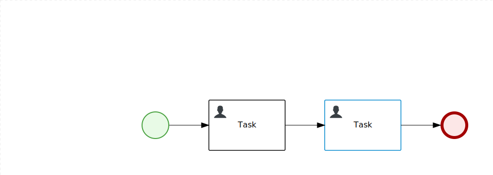

How to test Dynamic SLA
=======================

Import this project into Business Central, in process `TestDynamicSLA.DynamicSLAProcess` for both User Tasks set your Actor, save process and Build And Deploy project.

Start process `TestDynamicSLA.DynamicSLAProcess` and provide SLA value during start up like `15s`.

Claim tasks and finish tasks, check status of SLA for Process Instance. Try different values of SLA (smaller/higher) during process start to Met/Violate SLA.
